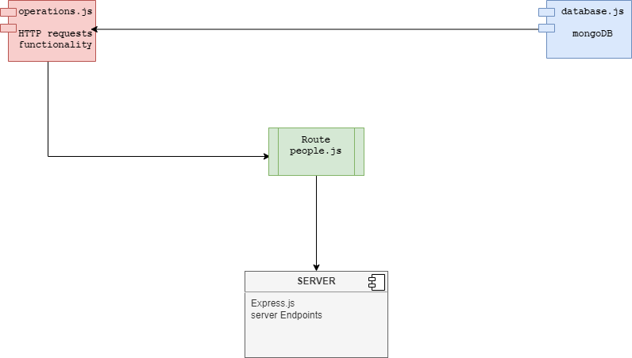

# `Author Name : Mamoun kamal ismael alshishani`

# `Email : mamoun.bursi@yahoo.com`

## server: can_of_books_backend

## how to run the server application working

### 1.in terminal on the root run mongoDB by entering `sudo service mongodb start`

### 2.Run the server by `npm start` on terminal

`-________________________________________________________________________-`

### this is server side for react application with mongoDB as the database!

### what technologies and tools are used on the server  :

***1.`Node.js` is used for this server side application***

***2.`Express framework` has been used for Node.js***

***3.`MongoDB` is used for server database***

***4.`HTTP CRUD Operations` are used on application ENDPOINTS***

## `server deployed on heroku`

**base endpoint :**
[Heroku Link](https://can-of-books-srv.herokuapp.com/)

**get database data endpoint :**
[Heroku Link](https://can-of-books-srv.herokuapp.com/books?EmailQuery=mamoun.alshishani@yahoo.com) 

## `Server UML :`

